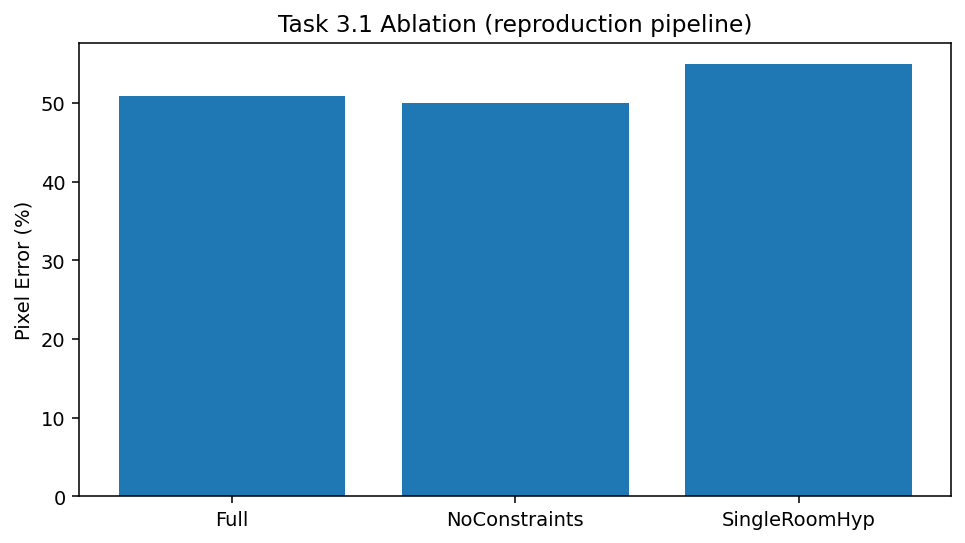
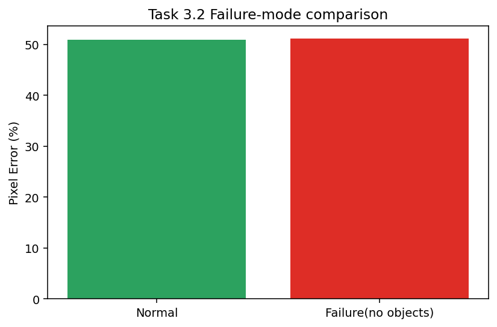
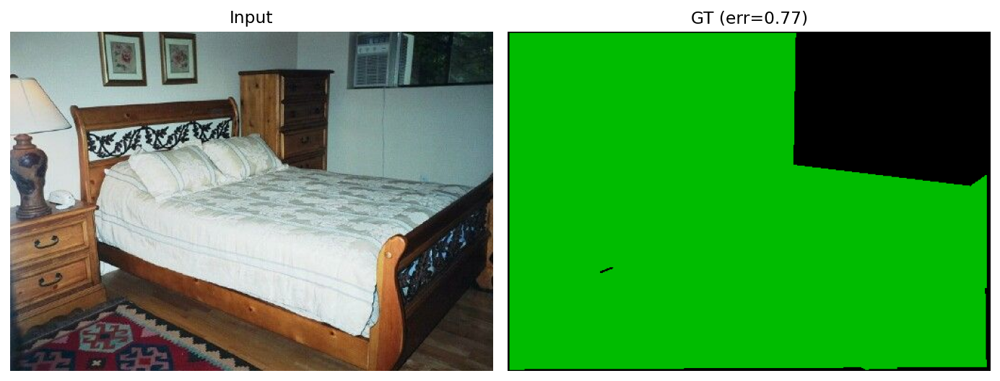
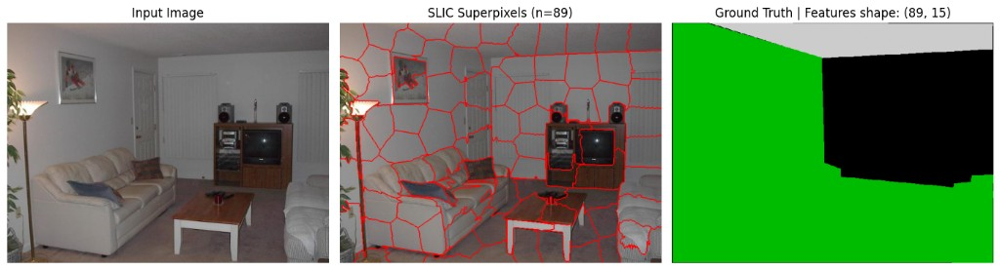
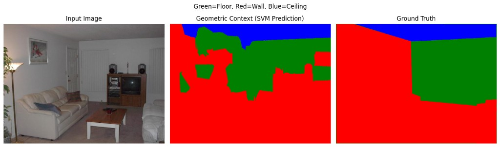
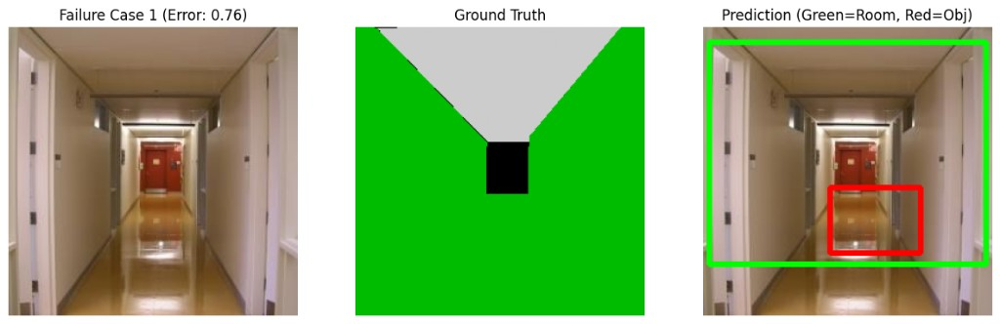

# Part B Report

**Course:** Advanced Machine Learning  
**Exam:** Mid-Semester Examination (Part B)  
**Student:** C Murali Madhav (`230115`)  
**Paper:** *Estimating Spatial Layout of Rooms using Volumetric Reasoning about Objects and Surfaces* (NeurIPS 2010)

## 1) Paper summary (in my own words)

Lee et al. (2010) improve single-image indoor room layout estimation by introducing explicit volumetric reasoning between room surfaces and clutter objects. Instead of only image-plane clutter handling, they generate room and object hypotheses, reject physically incompatible combinations using containment/exclusion constraints, and score scene configurations with structured prediction. The core claim is that these 3D constraints improve spatial layout estimation over prior approaches that reason mostly in 2D image space.

## 2) Reproduction setup and result

I used the same reproduction pipeline I built from my selected paper workflow: Hedau data loading, superpixel-based geometric-context estimation (SVM), room/object hypothesis generation, compatibility filtering, beam-search-style selection, and random-search weight tuning (CPU-feasible simplification instead of full Structured SVM).

**Weights used for evaluation:**
- `w = [0.88496431, 0.38328424]`
- `w_phi = -2.4675049607720414`

**Evaluation output on test set:**
- `Test Set Pixel Error: 0.5026 (50.26%)`

**Comparison to paper:**
- Paper reports approximately `16.2%` (OM+GC, full Structured SVM setting).
- My result is substantially worse, but this is expected given simplifications in scoring, learning, and hypothesis generation versus the original method.
- The reproduction still helps identify where the method gains and fails under a practical CPU-only implementation.

## 3) Ablation findings (Task 3.1)

I ran two component ablations:
- **NoConstraints:** remove object-room compatibility filtering.
- **SingleRoomHyp:** reduce room-hypothesis diversity to one hypothesis.

Interpretation:
- `SingleRoomHyp` clearly hurts performance most, showing that hypothesis diversity and late commitment are important.
- `NoConstraints` in this simplified pipeline does not produce a strong degradation, suggesting object-branch influence on the final metric is weaker than expected in this reproduction.

## 4) Failure mode analysis (Task 3.2)

Failure scenario: object hypotheses are removed (`generate_object_hypotheses -> []`), which should reduce volumetric reasoning benefit.

Observed result:
- **Normal:** `50.94%`
- **Failure (no objects):** `51.09%`

This is an **honest marginal degradation**, indicating weak object-branch influence in the current simplified reproduction. A key limitation is that the current scoring/loss is dominated by room-mask agreement, so removing objects does not strongly change final room polygon quality.

For stronger evidence, a better failure experiment should directly perturb room geometry quality (for example, corrupt vanishing-point/line cues or degrade room-hypothesis quality), or evaluation should include explicit object-layout consistency penalties.

## 5) Representative qualitative outputs

The following figures support qualitative interpretation and debugging of pipeline behavior:

### Additional shared qualitative evidence

Superpixel segmentation and feature extraction preview (Task 2 preprocessing):

Geometric context prediction versus ground truth (appearance model behavior):

Representative high-error qualitative case from failure visualization:

## 6) Reflection

- **What I could not fully implement:** exact original Structured SVM training with full constraint generation and legacy orientation-map stack as in the paper.
- **What surprised me:** even with a simplified implementation, room-hypothesis quality has a stronger effect than object-constraint toggling in current metrics.
- **What I would revisit with more time:** stronger room/object hypothesis generation, closer alignment to paper’s feature design, and a metric that better captures object-layout consistency.

